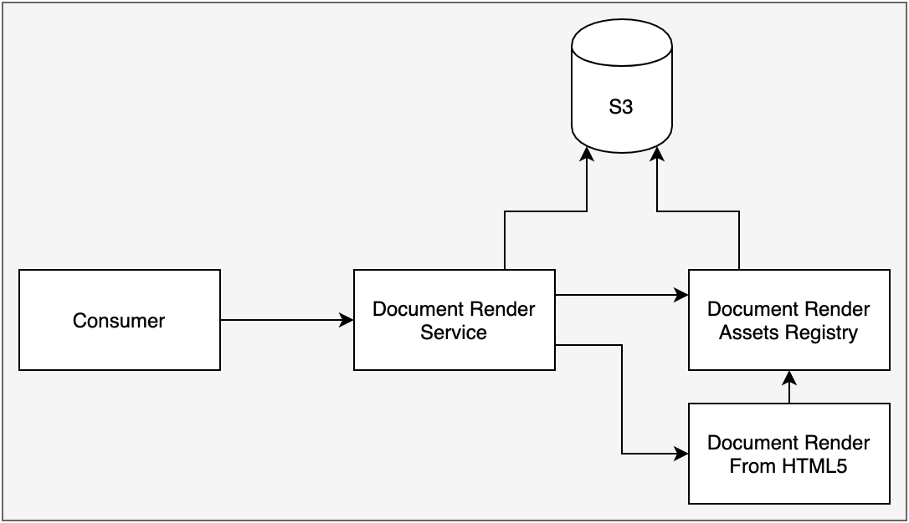
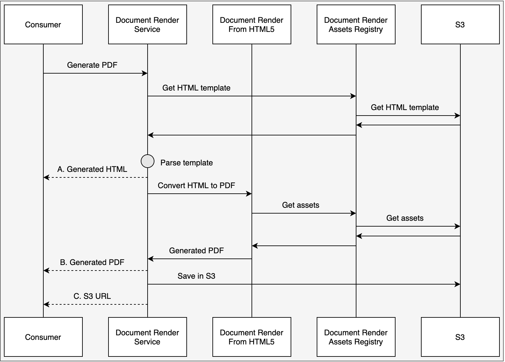

# Document Render Design

Here you can find some diagrams to help you visualise the Document Render platform.

## High Level Design

## Sequence Diagram 

The sequence of events depends on 2 things:

- What type of document are you generating i.e. HTML or PDF
- Do you want the generated document to be returned or stored in S3?

The above sequence diagram shows 3 potential exit points:

- Generate a HTML document and return it
- Generate a PDF document and return it
- Generate a HTML / PDF document and store it in S3

## Additional links

[Draw.io source](../../../assets/chs/document_render/design/docRender.drawio)

## Navigation

- [back](../README.md)

